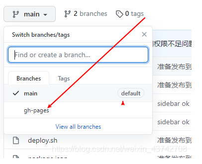
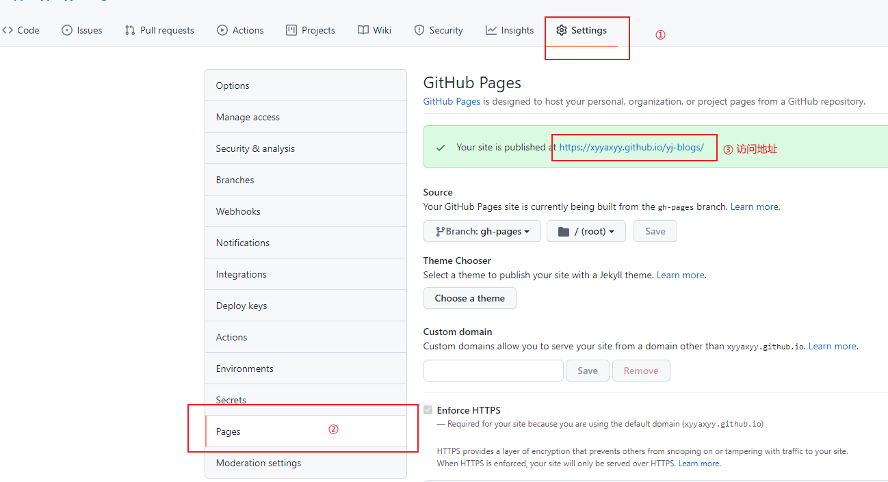

::: tip
这里只介绍手动部署和自动部署到 github 服务器
:::

## 一、手动部署
打开项目设置的 <code>GitHub Pages</code> 模块，将 <code>Source</code>设置为 <code>gh-pages</code>，这样我们就可以将博客项目放在 <code>master</code> 分支，而部署到 <code>gh-pages</code> 分支。
### 1、在根目录新建一个 <code>deploy.sh</code> 文件
```sh
# 确保脚本抛出遇到的错误
set -e

# 生成静态文件
yarn build # npm run build

# 进入生成的文件夹
cd dist

# 如果是发布到自定义域名
# echo 'www.xyyaxyy-blogs.com'

git init
git add -A
git commit -m 'deploy3 发布信息'

# 如果发布到 https://<USERNAME>.github.io
# git push -f git@github.com:<USERNAME>/<USERNAME>.github.io.git master

# 如果发布到 https://<USERNAME>.github.io/<REPO>
git push -f git@github.com:xyyaxyy/yj-blogs.git master:gh-pages

cd -
```
### 2、在 <code>package.json</code> 文件中添加 **"deploy": "bash deploy.sh"**
```json {5}
{
    "scripts": {
        "dev": "vuepress dev . --temp .temp",
        "build": "vuepress build .",
        "deploy": "bash deploy.sh"
    }
}
```
### 3、一键部署命令
```sh
yarn deploy # npm run deploy
```
> windows系统下使用 bash 命令窗
### 4、部署成功，从Github服务器访问项目
前往<code>github</code>查看分支，如果有<code>gh-pages</code>分支，则说明部署成功。  



项目 > Settings > GitHub Pages , **蓝色的链接**即为访问地址。

你也可以自定义域名，就是下边的 **Custom domain**



## 二、Github Actions 实现自动部署

开始